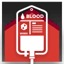

<div style="margin: 25px; padding: 0;">
    <p align="center" style="margin: 0; padding: 0;">
      
    </p>
    <h1 align="center" style="margin: 0; padding: 0; color: #D83A32;">WarfPlanner</h1>
</div>

## FOR NOW IT IS ONLY A PoC (Proof of Concept) AND IT IS NOT USABLE YET

STATUS: **WIP** \
It is not usable yet, but i hope it will be one day.

## About

WarfPlanner is a tool for Arknights mobile game. It allows you to plan your characters upgrades, and see how much
resources you have and need. \
It uses AI to recognize materials from screenshots or open client of depot screen, and OCR to recognize amounts and type
of materials.

## Development

### TODO
- Fix character search box
- Add save plans
- Add tooltips to icons
- Add Import/Export plans for:
    - https://gamepress.gg
    - https://penguin-stats.io
- Add screencapture from game
- Add AI for materials from screenshots/screencapture
- Add OCR for materials amounts
- Make it usable
- Make it executable/installable
- Add hide and show for characters in character list

### TODO (in future if all above is done)
- Add rooster mechanism for characters like:
  - https://www.krooster.com/
- Add AI for characters recognition from screenshots/screencapture

### Dependencies
- Python 3.8-3.11
### Setup

### Scripts
```shell
.\deps # install dependencies
.\run XYZ p1 p2 # run python script from src/XYZ.py with parameters p1 and p2 that are optional
```
Python scripts:
```shell
.\run AILabels # downloads labels for AI training from roboflow
.\run AITest # test AI model on test screenshots
.\run AITrain # train AI model via ultralytics/ultralytics (yolov8)
.\run App window prod # run GUI app (main script) in window production mode modes: browser, window and dev, prod
.\run GenerateData # download Arknights data from Kengxxiao/ArknightsGameData and images from yuanyan3060/ArknightsGameResource
```
## Acknowledgements / links:
- AI:
    - model and training:
        - [ultralytics/ultralytics](https://github.com/ultralytics/ultralytics)
    - labeling:
        - [roboflow](https://app.roboflow.com)
        - [autodistill/autodistill](https://github.com/autodistill/autodistill)
        - Labels for AI training are published via [Roboflow Universe](https://universe.roboflow.com)
          on [this link](https://universe.roboflow.com/moques/arknightsmaterials).
- OCR:
    - [tesseract-ocr/tesseract](https://github.com/tesseract-ocr/tesseract)
- Arknights:
    - data:
        - [Kengxxiao/ArknightsGameData](https://github.com/Kengxxiao/ArknightsGameData)
        - [Kengxxiao/ArknightsGameData_YoStar](https://github.com/Kengxxiao/ArknightsGameData_YoStar)
    - images:
        - [yuanyan3060/ArknightsGameResource](https://github.com/yuanyan3060/ArknightsGameResource)
        - [Aceship/Arknight-Images](https://github.com/Aceship/Arknight-Images)
- Random images:
  - [https://picsum.photos](https://picsum.photos)
  - [https://source.unsplash.com](https://source.unsplash.com)
  - [https://loremflickr.com](https://loremflickr.com)
